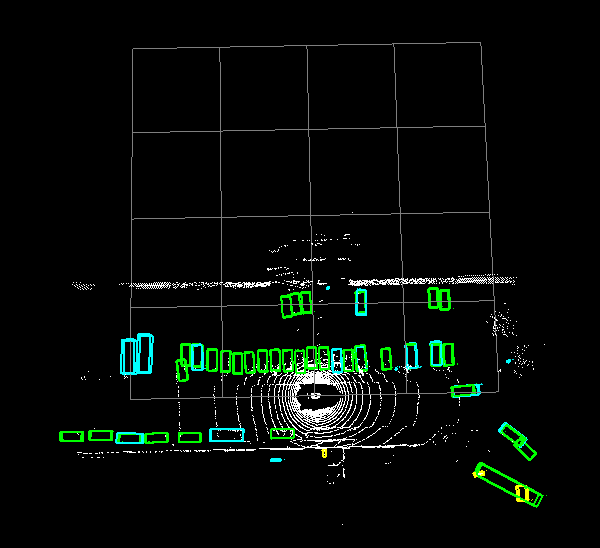

## Visualization

Visualization tools are located in ```tools``` directory. To visualize dataset and the corresponding prediction, try to
use ```viz_data.py``` script.

Taking NuScenes dataset as an example, the data to be visualized should be formatted as a ```.txt``` file, with each row being one of the objects:

| obj. type | obj. code | score | x | y | z | l | w | h | angle | vx | vy |
| :---: | :---: | :---: | :---: | :---: | :---: | :---: | :---: | :---: | :---: |  :---: |  :---: |
| str | int | float | float | float | float | float | float | float | float | float |  float |

### Steps

1. put all prediction files in one single folder (e.g., second_pred)
2. run the command with point cloud file as argument, with ```YOUR_PC_FILE_PATH``` as the path to pc file and ```YOUR_PRED_PATH``` is the path
   you specified in step 1:

```python viz_data.py --cfg_file cfgs/viz_configs/nuscenes.yaml --data_path {YOUR_PC_FILE_PATH} --pred_path {YOUR_PRED_PATH}```

This should give you the prediction with point cloud shown in a separate window as below:

